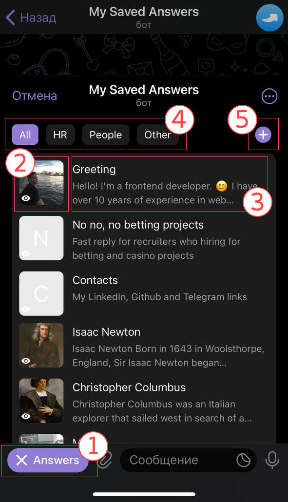
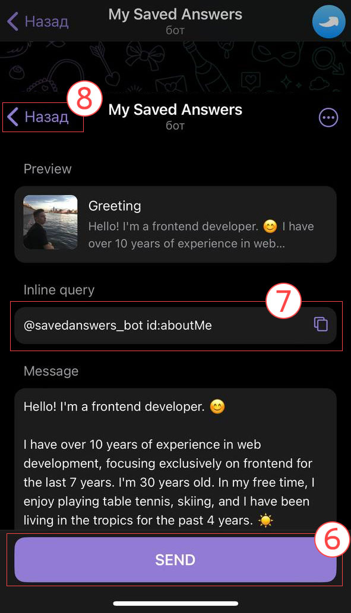
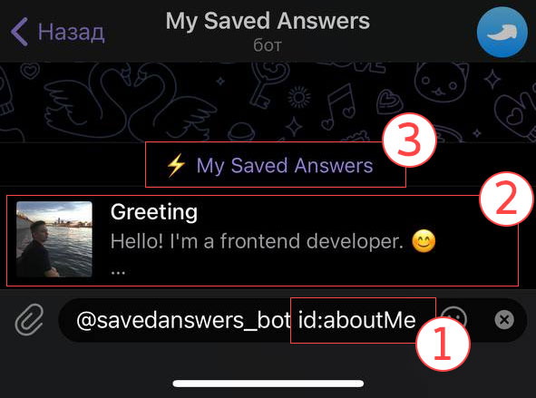
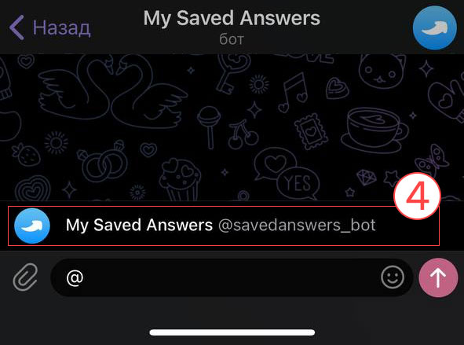
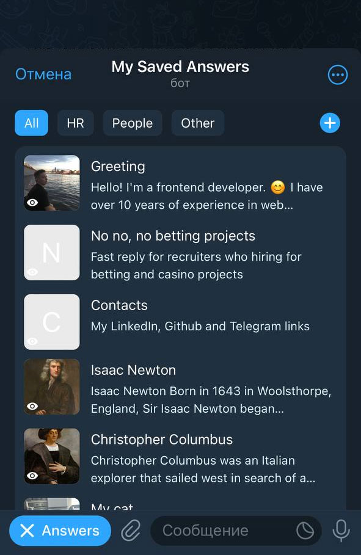
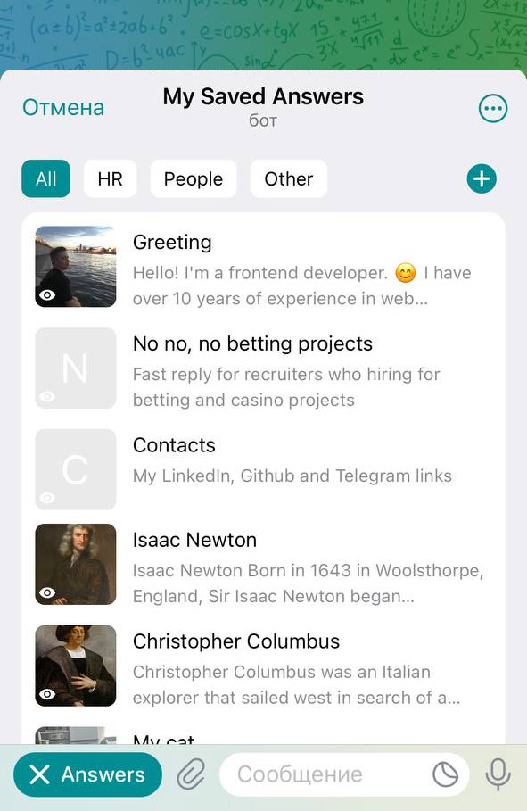

# ⚡ "My saved answers" Telegram MiniApp 

This repository contains a concept for a MiniApp within Telegram that allows users to send saved messages.

Participating in MiniApp Contest October 2023.

[](./LICENSE)


[](https://vkruglikov.github.io/my-saved-answers/)
[](https://github.com/topics/telegram-miniapp-contest-2023)

## Table of Contents

- [Motivation](#-motivation) 🌟
- [Demo](#demo) ▶️
- [Overview of MiniApp](#-overview-of-miniapp) 📱
  - [1. Menu button](#1-menu-button)
  - [2. Preview Thumb](#2-preview-thumb)
  - [3. Title and description](#3-title-and-description-of-saved-answer)
  - [4. Tag filters](#4-tag-filters)
  - [5. Add new answers](#5-add-new-answers)
  - [6. MainButton "SEND"](#6-mainbutton-send)
  - [7. Inline query preview](#7-inline-query-preview)
  - [8. BackButton](#8-backbutton) 
- [Overview of Inline mode](#-overview-of-inline-mode) 🤖
  - [1. Inline Query](#1-inline-query)
  - [2. Inline Query Result](#2-inline-query-result)
  - [3. WebApp link](#3-webapp-link)
  - [4. Fast access to `inline mode`](#4-fast-access-to-inline-mode)
- [Mocked data](#-mocked-data) 🎭
- [Overview of theme](#-overview-of-theme) 🎨
- [Compatibility and Potential Errors](#compatibility-and-potential-errors) ⚠️
- [Developers guide](#developers-guide) 👩‍💻
  - [Bot requirements](#bot-requirements)
  - [Local development](#local-development)
  - [Dependencies](#dependencies)
  - [Variables to .env](#variables-to-env)
  - [Structure of project](#structure-of-project)
  - [Developing MiniApp in Telegram Desktop](#developing-miniapp-in-telegram-desktop) 
  - [Deploying server on production](#deploying-server-on-production) 
- [License](#-license) 🥂

## 🌟 Motivation
In many popular messengers and social media platforms, there is a feature to send saved messages. Currently, Telegram does not have this functionality.

&nbsp;&nbsp;&nbsp;&nbsp;&nbsp;&nbsp;😊 **Business Communication**: In business, people use prepared responses for common queries, enabling quick replies in customer support.

&nbsp;&nbsp;&nbsp;&nbsp;&nbsp;&nbsp;⏰ **Time Efficiency**: Quick messages save time for users handling repetitive queries or messages.

&nbsp;&nbsp;&nbsp;&nbsp;&nbsp;&nbsp;🤝 **Limited Abilities**: Pre-set messages simplify communication for people with physical limitations.

&nbsp;&nbsp;&nbsp;&nbsp;&nbsp;&nbsp;✔️ **Error Reduction**: Prepared messages decrease communication errors, ensuring accuracy.

## Demo


The demo bot is available at [@savedanswers_bot](https://t.me/savedanswers_bot).

To launch in `inline mode`, enter `@savedanswers_bot` in any chat dialogue.\
[Overview of Inline mode](#overview-of-inline-mode)

⚠️ You can find information about errors that may occur while using the application by clicking on the link
[Compatibility and Potential Errors](#compatibility-and-potential-errors)

The web application is hosted on GitHub Pages and can be accessed at [vkruglikov.github.io/my-saved-answers](https://vkruglikov.github.io/my-saved-answers/)

🎭 The app uses [Mocked Data](#mocked-data)

## 📱 Overview of MiniApp

With MiniApp, you can view saved messages and filter them by tags.\
You can easily send these saved messages without leaving the conversation with the user.


<div style="display: flex; gap: 10px;">
    
    
</div>

### 1. Menu button
The menu button can open any MiniApp link.\
To set it up, use the command `/setmenubutton` via [@BotFather](https://t.me/BotFather)

In this app, it opens the link [vkruglikov.github.io/my-saved-answers](https://vkruglikov.github.io/my-saved-answers/)

### 2. Preview Thumb
The active area of the application, clicking on which opens a page with a preview of the saved message.

We are still inside the MiniApp, and the transition to another page is implemented using [react-router-dom](https://reactrouter.com/en/main)

<!-- TOC --><a name="3-calling-inline-mode"></a>
### 3. Title and description of saved answer
Title for describing saved message, opens in [inline mode](https://telegram.org/blog/inline-bots?setln=it) when clicked.

When clicked, the app performs two actions:
- Calls [HapticFeedback.notificationOccurred('success')](https://core.telegram.org/bots/webapps#hapticfeedback) - gives a vibration feedback.
- Calls [WebApp.switchInlineQuery](https://core.telegram.org/bots/webapps#initializing-mini-apps) with the string we want to insert in the input field. This method closes the MiniApp and opens [inline mode](https://telegram.org/blog/inline-bots?setln=it).

### 4. Tag filters
Here are the filter buttons for tags.\
They speed up navigation through saved messages and allow grouping of messages.

### 5. Add new answers
The "Add" button directs the user to the bot, where the functionality to add a new response can be implemented on the backend later.

Since this application operates entirely on [mocked data](#mocked-data), this feature has not been implemented yet.\
You will see a placeholder response from the bot.

### 6. MainButton "SEND"
A button on the message preview page, opens in inline mode when clicked.
Read more about WebApp.[MainButton](https://core.telegram.org/bots/webapps#mainbutton).

In the `react` app, I'm using the <MainButton /> component from the package [vkruglikov/react-telegram-web-app](https://github.com/vkruglikov/react-telegram-web-app#components).

When clicked, the app performs two actions:
- Triggers [HapticFeedback.notificationOccurred('success')](https://core.telegram.org/bots/webapps#hapticfeedback) - gives a vibration feedback.
- Calls [WebApp.switchInlineQuery](https://core.telegram.org/bots/webapps#initializing-mini-apps) with the string we want to insert in the input field. This method closes the MiniApp and opens [inline mode](https://telegram.org/blog/inline-bots?setln=it).

### 7. Inline query preview
Preview of inline query for a quick response.\
Upon clicking, it copies the inline query to the clipboard.

### 8. BackButton
When creating a multi-page web application, you need UI components to allow users to go back. MiniApp provides an object that allows displaying, hiding, and handling clicks on the native "Back" button.

Official documentation can be found [here](https://core.telegram.org/bots/webapps#backbutton).

In the `react` app, I'm using the <BackButton /> component from the [vkruglikov/react-telegram-web-app](https://github.com/vkruglikov/react-telegram-web-app#components) package.

## 🤖 Overview of Inline mode
In Telegram MiniApp, the inline mode is activated using the API [WebApp.switchInlineQuery](https://core.telegram.org/bots/webapps#initializing-mini-apps). This mode allows sending messages in a chat on behalf of the user.

Learn more about inline mode by reading [Introducing Inline Bots](https://telegram.org/blog/inline-bots?setln=it).

<div style="display: flex; gap: 10px;">
    
    
</div>

### 1. Inline Query
After calling [WebApp.switchInlineQuery](https://core.telegram.org/bots/webapps#initializing-mini-apps), the MiniApp closes, and the query string is inserted into the [inline mode](https://telegram.org/blog/inline-bots?setln=it) input field.

The server processes the `inline_query` request and returns a response using the [answerInlineQuery](https://core.telegram.org/bots/api#answerinlinequery) method.

I use [node-telegram-bot-api](https://www.npmjs.com/package/node-telegram-bot-api) to work with the Telegram API in Node.js.

### 2. Inline Query Result

The query result will display a list of saved messages available for sending, presented as [InlineQueryResult](https://core.telegram.org/bots/api#inlinequeryresult).

Clicking on it will send the message to the chat.

### 3. WebApp link
Starting from version 6.7, you can launch MiniApps from `inline_query` results. To do this, there's a field called `button` in the [answerInlineQuery](https://core.telegram.org/bots/api#answerinlinequery) method. To learn more about it, visit the [InlineQueryResultsButton](https://core.telegram.org/bots/api#inlinequeryresultsbutton) page.

In this app, I open the link [vkruglikov.github.io/my-saved-answers?inline](https://vkruglikov.github.io/my-saved-answers?inline) to determine the app's launch location based on the `inline` query parameter.

You can build your logic depending on where the app is launched.

### 4. Fast access to `inline mode`
To activate inline mode, you need to enter the bot's full name `@savedanswers_bot` in the user's chat.\
This might seem inconvenient and could reduce the effectiveness of quick responses.

However, after a few inputs, Telegram will suggest using the bot by simply entering the `@` symbol. This makes access to quick messages instantaneous.

## 🎭 Mocked data
In this project, we use mocked saved answers. These data are used both in MiniApp and [inline mode](https://telegram.org/blog/inline-bots?setln=it) to send messages.

You can modify or add any messages, but they will remain static. The file [`answers.js`](./answers.js) is located in the project's root folder, and the descriptions of types are in [`answers.d.ts`](./answers.d.ts).

To add functionality for adding/saving/deleting saved messages, the backend needs to be enhanced.

[answers.js](./answers.js)\
[answers.d.ts](./answers.d.ts)

## 🎨 Overview of theme

MiniApp uses CSS variables available within the bot. This makes the application look completely native inside Telegram and supports custom themes.

For more details about styles, read the documentation page [ThemeParams](https://core.telegram.org/bots/webapps#themeparams).

<div style="display: flex; gap: 5px;">
    
    
</div>


[WebApp.module.css](./src/WebApp.module.css)
```css
var(--tg-theme-bg-color)
var(--tg-theme-secondary-bg-color)
var(--tg-theme-text-color)
var(--tg-theme-hint-color)
var(--tg-theme-button-color)
var(--tg-theme-button-text-color)
```

To configure the header color and background color of the application, you can use the methods `setHeaderColor` and `setBackgroundColor`.

[WebApp.tsx](./src/WebApp.tsx)
```javascript
WebApp.setHeaderColor('secondary_bg_color');
WebApp.setBackgroundColor('secondary_bg_color');
```

## ⚠️ Compatibility and Potential Errors
⚠️ When working with the WebApp API and aiming to maintain backward compatibility with older clients, it is necessary to check the client's version. For example, a method like [isVersionAtLeast(version)](https://core.telegram.org/bots/webapps#initializing-mini-apps) could be used.\
In this project, I am ignoring such checks and expecting that the client will have the latest version of the API at the time of writing, which is **Bot API 6.9**.

⚠️ In Telegram Desktop version I recommend to use only [inline mode](https://telegram.org/blog/inline-bots?setln=it), because during the bot development, unstable behavior of the [switchInlineQuery](https://core.telegram.org/bots/webapps#initializing-mini-apps) method was observed in Telegram Desktop versions started from `/setmenubutton`. Please take this into account when making modifications.

✅ I conducted the final testing and development on `version 10.1.2(27198)` of the Telegram application, on `IPhone 14 IOS 16.6.1`.

## Developers guide

### Bot requirements
First, we need to create a bot.

Creating a bot is possible by following the instructions from [@BotFather](https://t.me/BotFather).\
To work in [inline mode](https://telegram.org/blog/inline-bots?setln=it), activate it with the command `/setinline`.\
For configuring the menu button, use the command `/setmenubutton`.

### Local development

Installing dependencies and running the local server:
```shell
npm install && npm run dev
```
And open http://localhost:9000/

The `npm run dev`  command starts a local server for the bot in polling mode and a local webpack server for the React application.

Building the MiniApp static to folder `dist`
```shell
npm run build
```

Additionally, there is a workflow set up in the project to deploy static files to Github Pages.

### Dependencies
The project has few main dependencies:

- **NodeJS 20** _.nvmrc_
- **Typescript**
- `client` React JS ^18
- `client` [react-telegram-web-app](https://github.com/vkruglikov/react-telegram-web-app)
- `server` [node-telegram-bot-api](https://www.npmjs.com/package/node-telegram-bot-api)

You can see the full list of dependencies in the [package.json](./package.json) file

### Variables to .env
| name                          | description                                                                      | required            |
|-------------------------------|----------------------------------------------------------------------------------|---------------------|
| TELEGRAM_BOT_TOKEN            | You can get a token at [@BotFather](https://t.me/BotFather)                      | yes                 |
| TELEGRAM_WEBAPP_URL           | Full URL address for WebApp, needed for creating links to assets in inline mode. | yes                 |
| TELEGRAM_BOT_NAME             | Telegram bot username                                                            | yes                 |
| TELEGRAM_API_TEST_ENVIRONMENT | `true` or empty                                                                  | no                  |
| DEV_HTTPS_HOST                | hostname for local development, when you want to use https                       | no                  |
| DEV_PATH_KEY                  | Relative path to https key                                                       | no (yes for https)  |
| DEV_PATH_CERT                 | Relative path to https cert                                                      | no (yes for https)  |

### Structure of project
Project structure overview without going into details

```
.
├── public/
│   ├── assets                # In this folder, there are assets for the bot's operation
│   └── index.html            # Index page for MiniAPP where telegram-web-app.js is included
├── src/
│   ├── components            # Some React UI components
│   ├── icons                 # Icons
│   ├── pages/
│   │   ├── AnswersPage.tsx   # Main page of MiniAPP with viewing all saved answers
│   │   └── PreviewPage.tsx   # Preview page for answers
│   │   ├── NotFoundPage.tsx
│   ├── WebApp.tsx            # Main root component for MiniAPP
│   └── WebApp.module.css
├── server/
│   └── index.mjs             # Server-side component in Node.js for the bot
├── answers.js                # Mocked data of saved messages
├── answers.d.ts
├── webpack.config.js
└── .env
```

### Developing MiniApp in Telegram Desktop

When you're developing a MiniApp, you might need to test your application in a real environment like Telegram Desktop.\
To run the app in MiniApp, we have to use an HTTPS connection.

#### Below is an example of setting up an HTTPS connection for `local.my-saved-answers.app` host

You can use [mksert](https://github.com/FiloSottile/mkcert) to generate a certificate for local development, and set `.env` variables.

```dotenv
DEV_HTTPS_HOST=local.my-saved-answers.app
DEV_PATH_KEY=local.my-saved-answers.app-key.pem
DEV_PATH_CERT=local.my-saved-answers.app.pem
```

Add domain to `/etc/hosts`
```shell
127.0.0.1 local.my-saved-answers.app
```

Now your local development server will run via HTTPS, and you can use it as the URL for your Telegram MiniApp

### Deploying server on production

To deploy the bot on the server, only certain files are needed.
```
├── server/
├── answers.js
├── package.json
├── package-lock.json
└── .env
```

Installing dependencies
```shell
npm install --production
```

Server startup
```shell
npm run server
```

## 🥂 License

[MIT](./LICENSE)